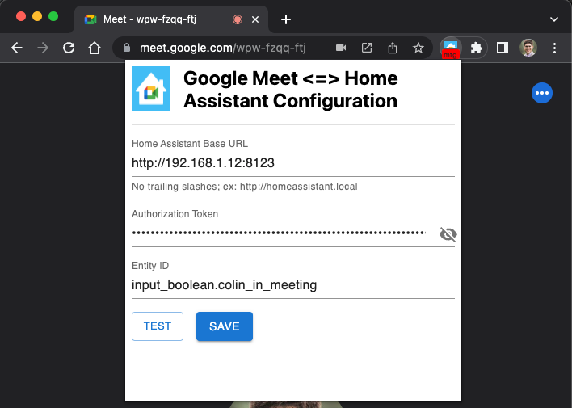

# Google Meet <=> Home Assistant Chrome Extension

Chrome extension that relays your Google Meet status (in meeting or not) to Home Assistant so you can build your own DIY "On Air" light or other automations.

It works by detecting whether you have any active meetings open in any Chrome tabs, and then toggles an Input Boolean in Home Assistant accordingly which you can use to create automations from.

See [my blog post for more details](https://www.colinodell.com/blog/202207/diy-on-air-light-automation-google-meet-chrome-extension).

## Installation

1. Download this project
2. Run `yarn install && yarn build` in the repo root
3. Visit [`chrome://extensions`](chrome://extensions) in your browser
4. Enable Developer mode
5. Click on "Load unpacked extension" and select the `dist` folder that yarn built

## Configuration

1. [Generate a long-lived access token in Home Assistant](https://www.atomicha.com/home-assistant-how-to-generate-long-lived-access-token-part-1/)
2. [Create a new input boolean in Home Assistant](https://www.home-assistant.io/integrations/input_boolean/)
3. Click on the Chrome extension in your browser to open the configuration page and configure your Home Assistant URL, auth token, and input boolean entity ID accordingly.

## Testing

Simply create or join a Google Meet meeting in your browser, and the extension will automatically toggle your input boolean entity in Home Assistant.  The Chrome extension icon should display `mtg` if it detects that you are in a meeting, and the input boolean should toggle itself accordingly when you join/leave meetings.

## Automation Ideas

With everything set up and working you can now use that input boolean to create automations in Home Assistant! For an "On Air" light, you could create an automation that uses any Home Assistant [light integration](https://www.home-assistant.io/integrations/#light) to toggle some light on/off when you join/leave a meeting. This could be a Philips Hue light, a LED embedded in an Arduino/ESP8266/Raspberry Pi, or any other light you have in your Home Assistant instance!

Personally, I've repurposed an older [Adafruit Weather Lamp](https://learn.adafruit.com/feather-weather-lamp) project I built by flashing [WLED](https://www.home-assistant.io/integrations/wled/) onto the board and configuring presets for when I'm in a meeting (spinning red colors) or not (solid green).

## FAQs

**Can I just download this from the Chrome store?** Not at the moment - I haven't gotten around to creating a pipeline to build and package this yet.  Hopefully soon, though!

**Does this support other browsers and/or meeting providers?** No, and I don't have plans to do so, but PRs to add support are certainly welcome!

**Can this detect if the microphone or camera is actually in use?** No, that's a rabbit hole I've already tried going down without much success.  I'm sure it's possible but the effort required to figure out a reliable, cross-platform way to detect that is simply not worth it.

**Why did you use React for a three-field form? Isn't it overkill?** Yes, but I'm just starting to learn React and thought this would be a great way to practice :)
